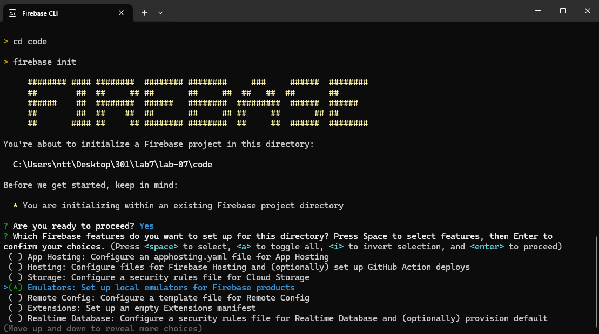
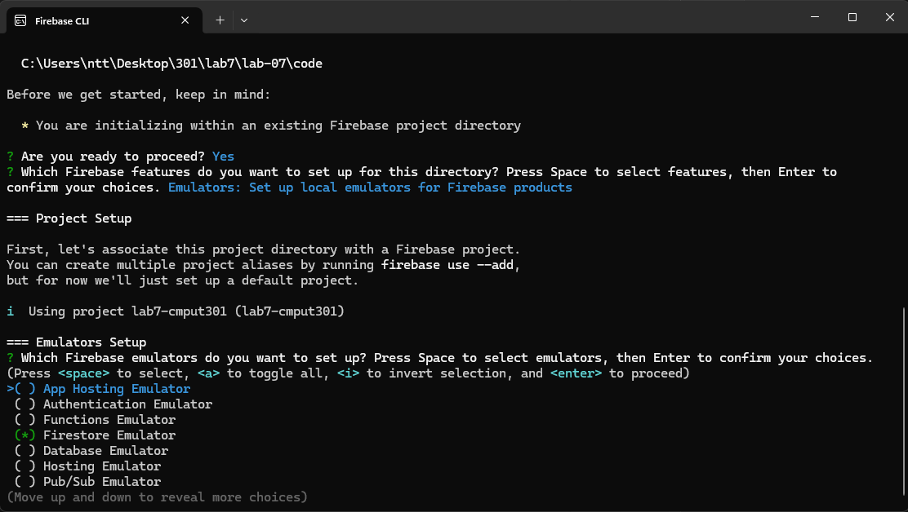
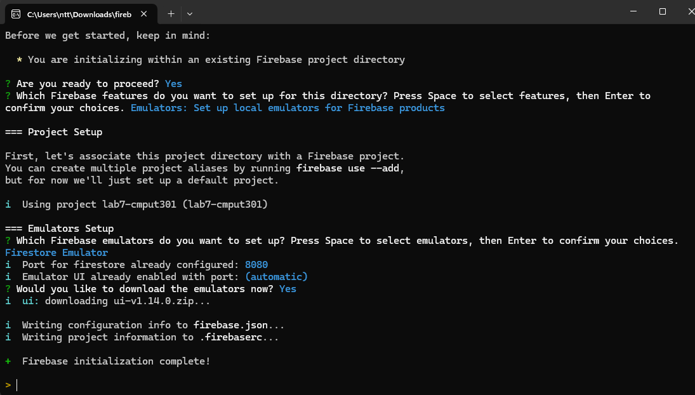

# Lab 07 Instructions [](https://i.imgur.com/p1qqUON.png)

Testing your database can be done with Firebase Local Emulator Suite. This suite allows you to run your Firebase services locally, so you can test your database without affecting your production data. More about Firebase Local Emulator Suite can be found [here](https://firebase.google.com/docs/emulator-suite).

## Description of Codebase

The code base contains a basic movie list app similar to lab 5, but the add, edit, and delete functionality has already been implemented for you. We will use this existing application as a starting point for our UI testing.

## Instructions 
### 1. Install [Firebase CLI](https://firebase.google.com/docs/cli#install_the_firebase_cli). 

**For MacOS and Linux users:** the `firebase` command should be available globally after installation. Run `firebase --version` in your terminal to check if the installation is successful.

**For Windows users:** You can run the `firebase-tools-instant-win.exe` file to access the Firebase CLI. After running the .exe file, run `firebase --version` in the opened terminal to check if the installation is successful.

### 2. Add Firebase Firestore to your project

This step is very similar to your lab exercise in Lab 5. Please go to the [Firebase Console](https://console.firebase.google.com/) and create a new project.
Make sure the project is created in the same Google account you used for the previous labs. 

Create a Firebase Firestore database for your project. **Make sure to use** `com.example.androiduitesting` **as the Android Package name!** Link your new Firebase project to your android app by following the instructions on the Firebase Console, and download the `google-services.json` file to your `app/` directory. Then, run your app in Android Studio to make sure the connection is successful. Try adding/editing a few movies and check if the changes are reflected in the Firebase Firestore console.

### 3. Beginning to Emulate

In the `code/` directory which contains the gradle files for the project, run the following command in your terminal to intialize a Firebase project:

```bash
firebase init
```
> [!NOTE]
> ***For Windows users***, open the Firebase CLI console by running `firebase-tools-instant-win.exe`. Run `cd` to reveal the path that you are in. Navigate to the `code/` directory of this lab, then run `firebase init`. 

The CLI tool will ask you to choose which services you want, use the arrow key to navigate up or down the list, then choose `Emulators: Set up local emulators for Firebase products`, press Enter to continue. 



Next, choose `Firestore Emulator`, press Enter to continue.



Specify the port for the emulator, the port for the emulator UI, and choose `yes` to download the emulator files. 



This will create the configuration files needed to run a Firebase emulator locally.

Next, to start the emulator, run the command:

```bash
firebase emulators:start
```
> [!WARNING]
> If at this state, firebase errors out because you don't have `java` in your path, you need to go add it, and repeat the steps above in a new terminal. We can reuse the Android Studio java installation for this. Navigate to where your Android Studio is installed, under `jbr/bin`, and copy this path. For windows users, add this path to your **user variables** PATH (Not system variables). For MacOS and Linux users, you can run `export PATH=$PATH:/path/to/jbr/bin` in your terminal.

The emulator should start, and you should be able to click on the link and see the emulated Firestore database.


### 4. Testing with Intent

Instrumented tests run on an Android device, either physical or emulated.
The app is built and installed alongside a test app that injects commands
and reads the state. Instrumented tests are usually UI tests, launching an
app and then interacting with it. We will be using Espresso for your intent testing.

To use the Espresso library, some dependences must be added to the **app Gradle
(build.gradle(Module:app)) file**. These have already been added to your repository, but will need to be added to your project.

```Java
testImplementation("junit:junit:4.13.2")
androidTestImplementation("androidx.test.ext:junit:1.1.5")
androidTestImplementation("androidx.test.espresso:espresso-core:3.5.1")
```

For our first intent test, we are going to verify that the user interface for adding a valid movie properly functions. To make a test for UI functionalities, we will create a class called `MainActivityTest` under the **com.example.androiduitesting(androidTest)** folder. For JUnit to run the Espresso tests, we need to add the following decorators to the class:

```Java
@RunWith(AndroidJUnit4.class)
@LargeTest
public class MainActivityTest {

}
```

The JUnit test runner allows us to run these instrumented tests on our Android device, and report the results in a concise format.

To test the `MainActivity` we need to make a rule so our runner knows which activity to target (our app only has one, but your project **should** have multiple). 

```Java
@Rule
public ActivityScenarioRule<MainActivity> scenario = new
ActivityScenarioRule<MainActivity>(MainActivity.class);
```

Now, we can add our first test. This test checks to see that we can add a movie which has valid user input.

```Java
@Test
public void addMovieShouldAddValidMovieToMovieList() {
    // Click on button to open addMovie dialog
    onView(withId(R.id.buttonAddMovie)).perform(click());

    // Input Movie Details
    onView(withId(R.id.edit_title)).perform(ViewActions.typeText("Interstellar"));
    onView(withId(R.id.edit_genre)).perform(ViewActions.typeText("Science Fiction"));
    onView(withId(R.id.edit_year)).perform(ViewActions.typeText("2014"));

    // Submit Form
    onView(withId(android.R.id.button1)).perform(click());

    // Check that our movie list has our new movie
    onView(withText("Interstellar")).check(matches(isDisplayed()));
}
```

If you run the test, it should pass, but we are still connected to our original Firestore database, so the created movie will appear in our database. This is an issue, as all this test data will clog up our database, potentially cause our tests to be flaky, and we do not have an easy way to clear out this data, or add any starting data we need (such as a user).

### 5. Emulating our Problems Away

For local testing, we will use our emulated database we setup instead of the cloud hosted one. All we have to do is add a `setup()` function for our test which runs before all of our tests. This function will connect our application to the emulated database instead of the cloud instance:

```Java
@BeforeClass
public static void setup(){
    // Specific address for emulated device to access our localHost
    String androidLocalhost = "10.0.2.2";

    int portNumber = 8080;
    FirebaseFirestore.getInstance().useEmulator(androidLocalhost, portNumber);
}
```

The `@BeforeClass` decorator specifies that this should be run before any tests in the class are. 

> [!WARNING]  
> The port number you need may be different depending on your settings and if that port is already allocated. Please make sure to check the port your emulator is hosted on in the terminal.

Now if we run our test, we can see that the data is created in our emulated database instead of the cloud hosted one.

### 6. Drop Database

After running our test, we want our database to be automatically cleaned. To manually clear our data, we can call an API on the emulator using curl. Make sure you use your Firebase project ID:

```bash
curl -v -X DELETE "http://localhost:8080/emulator/v1/projects/YOUR-PROJECT-ID-HERE/databases/(default)/documents"
```

This will clear our database, but we want to do this automatically after our test runs. We can do this using a `tearDown()` method. We will run this after each test has finished running. This is done using the `@After` decorator. The method to clear the database is below. Don't worry about the implementation details of the method, it is outside the scope of the lab. Just make sure to use your project name for the `projectId` variable:

```Java
@After
public void tearDown() {
    String projectId = "YOUR-PROJECT-ID-HERE";
    URL url = null;
    try {
        url = new URL("http://10.0.2.2:8080/emulator/v1/projects/" + projectId + "/databases/(default)/documents");
    } catch (MalformedURLException exception) {
        Log.e("URL Error", Objects.requireNonNull(exception.getMessage()));
    }
    HttpURLConnection urlConnection = null;
    try {
        urlConnection = (HttpURLConnection) url.openConnection();
        urlConnection.setRequestMethod("DELETE");
        int response = urlConnection.getResponseCode();
        Log.i("Response Code", "Response Code: " + response);
    } catch (IOException exception) {
        Log.e("IO Error", Objects.requireNonNull(exception.getMessage()));
    } finally {
        if (urlConnection != null) {
            urlConnection.disconnect();
        }
    }
}
```

There is one more thing we need to do. By default, Android does not allow `http` traffic, only `https`. As such, we need to add a configuration file to make an exception for this domain. Under the `res/xml` folder, make a file called `network_security_config.xml`. In this file, we will add the local domain our Android app uses to communicate with our Firebase emulator. 

```xml
<?xml version="1.0" encoding="utf-8"?>
<network-security-config>
    <domain-config cleartextTrafficPermitted="true">
        <domain includeSubdomains="true">10.0.2.2</domain>
    </domain-config>
</network-security-config>
```

Then, under the `manifests` folder in the `AndroidManifest.xml` files, under the `<application>` tag, we have to add this file as our nettwork security configuration:

```xml
   <application
        ...
        android:networkSecurityConfig="@xml/network_security_config"
        ...
    ></application>
```

Now, we can run out test again and see that there is no data in our emulated database after, but the test passes.

> [!Note]  
> If you have an issue with the step allowing our app to connect to the emulator domain, take a look at the following [StackOverflow post](https://stackoverflow.com/questions/45940861/android-8-cleartext-http-traffic-not-permitted).


### 7. Unhappy Paths

Sometimes, the user will attempt to do something with our application which we want to prevent. We will add a test to check that the user is shown an erorr if they attempt to add a movie without a title.

```Java
@Test
public void addMovieShouldShowErrorForInvalidMovieName() {
    // Click on button to open addMovie dialog
    onView(withId(R.id.buttonAddMovie)).perform(click());
    // Add movie details, but no title
    onView(withId(R.id.edit_genre)).perform(ViewActions.typeText("Science Fiction"));
    onView(withId(R.id.edit_year)).perform(ViewActions.typeText("2014"));
    // Submit Form
    onView(withId(android.R.id.button1)).perform(click());
    // Check that an error is shown to the user
    onView(withId(R.id.edit_title)).check(matches(hasErrorText("Move name cannot be empty!")));
}
```

When we run the test, we can see it passes becuase the error is shown to the user.

### 8. Growing a Database

Sometimes, you will want to have some data already in the database for your tests to use. This is where the concept of "seeding" the database comes in. Seeding the database just involves adding some mock data into it for your tests to use. This can be done using a method with the `@Before` decorator. It is very similar to the `@After` decorator, but it runs before each test instead of after. Using the following method, we can populate the database with two existing movies before running any tests.

```Java
@Before
public void seedDatabase() {
    FirebaseFirestore db = FirebaseFirestore.getInstance();
    CollectionReference moviesRef = db.collection("movies");
    Movie[] movies = {
            new Movie("Oppenheimer", "Thriller/Historical Drama", "2023"),
            new Movie("Barbie", "Comedy/Fantasy", "2023")
    };
    for (Movie movie : movies) {
        moviesRef.document().set(movie);
    }
}
```

We can also add a test to see that these movies are displayed in the list when we start our app. In this test, we will click on one of the items added by our seeding method and check that the details are displayed correctly.

```Java
@Test
public void appShouldDisplayExistingMoviesOnLaunch() {
    // Check that the initial data is loaded
    onView(withText("Oppenheimer")).check(matches(isDisplayed()));
    onView(withText("Barbie")).check(matches(isDisplayed()));
    // Click on Oppenheimer
    onView(withText("Oppenheimer")).perform(click());
    // Check that the movie details are displayed correctly
    onView(withId(R.id.edit_title)).check(matches(withText("Oppenheimer")));
    onView(withId(R.id.edit_genre)).check(matches(withText("Thriller/Historical Drama")));
    onView(withId(R.id.edit_year)).check(matches(withText("2023")));
}
```
